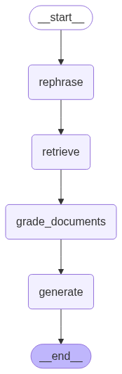

# AI Chat: RAG + Langgraph

## Requirement
- Build a chatbot UI that allows users to:
Ask about the services provided by this company Bike Hero
    - https://bikehero.sg/bike-servicing-and-repair-pricing
Request a quote for a specific service
- If the chatbot cannot confidently answer, it should:
    - Display a message suggesting escalation to a human agent
- The entire conversation history should be saved to a database

## Graph


## Tech Stack
- Frontend: see https://github.com/thomas-chiang/ai_bike_repair_price_quote_frontend
- Backend: Python, Langgraph, Fastapi
- Database: Firestore, Pinecone
- Cloud: firebase, gemini


## Setup

1. create .env file according to .env.example:
    - for serviceAccountKey.json, make sure it have firebase authentication and firestore write access
2. use poetry for dependency management:
```
# optional: in-directory virtual environment
poetry config virtualenvs.in-project true --list

# before running docker file (or cloud build):
poetry export -f requirements.txt --output requirements.txt
```

## Development
1. local run:
```
fastapi dev main.py
```
2. testing:
```
python api_test_client.py
```

